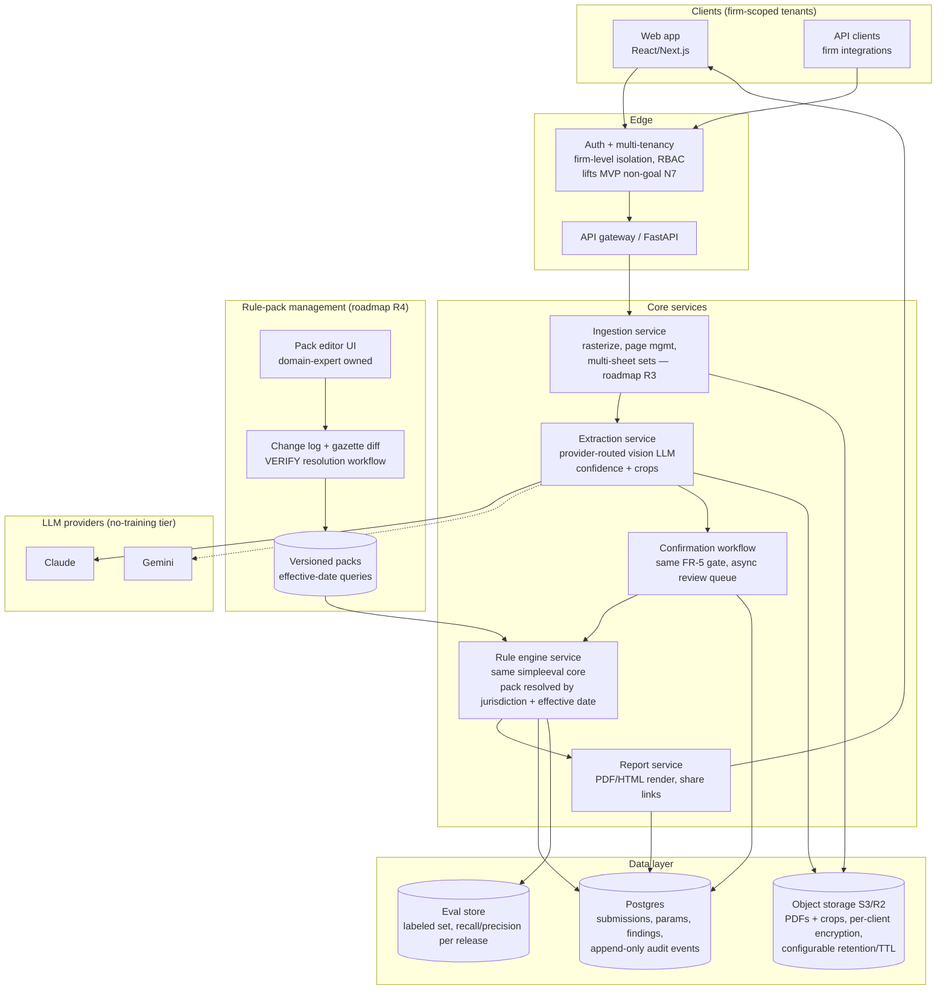

# Architecture — Production target (post-MVP, if demo approved)

Same domain objects as the MVP (PRD §11 report contract) — production swaps
the *sinks*, not the model. Migration = write the same objects to Postgres/S3
instead of session state. Drawn for the roadmap discussion; build only when a
real constraint appears.

## What changes vs MVP — and what must not

| Concern | MVP | Production |
|---|---|---|
| Persistence | session-only | Postgres (append-only audit events — legal artifact) + S3 with configurable retention |
| Access | shared password | per-firm auth, tenant isolation (hard requirement — drawings commercially sensitive) |
| Rule packs | YAML in repo | DB-backed + expert editor, changelog, gazette diff (R4) |
| Stack | Streamlit monolith | API + workers + SPA — only when multi-user/UX demands it |
| Scope | single sheet, A-3 only | multi-sheet sets (R3), more occupancies (R2), geometry Tier-2 (R1) |
| Eval | manual script | recall/precision tracked per release against labeled set; release gate = life-safety recall ≥ 0.90 |

**Must not change:** the FR-5 confirmation gate, FR-9 no-silent-pass, the
BNBC/RAJUK jurisdiction split, the non-certification disclaimer, and the PRD
§11 object shapes (they are the migration contract).

**Explicitly still out** (separate product track): structural/seismic review
(R5) — different discipline, different liability surface.
